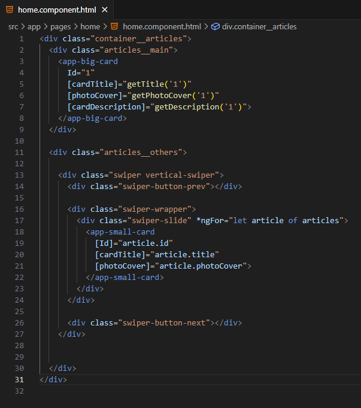
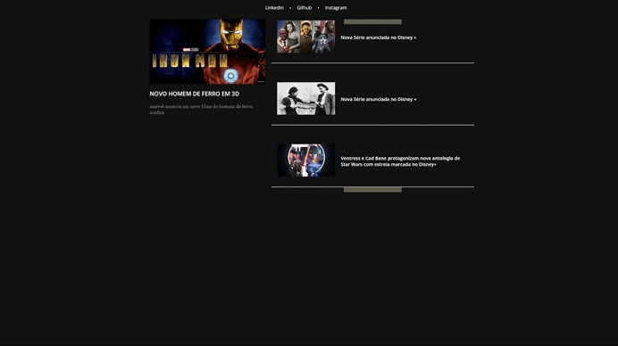

# Blog Angular - Desafio Decola Tech 2025

Este projeto implementa algumas funcionalidades  no blog desenvolvindo pelo - [@Felipão da Dio](https://github.com/felipeAguiarCode/angular-blog).

## Features Novas

 #### Adicionei ao projeto maneiras de renderizar os conteúdos de forma mais dinâmica, sendo assim ficando mais amigável à manutenção. 


 ### Carrossel de Notícias:
Agora a home conta com um carrossel contém todas as notícias. 

*Funcionamento* 🔽



## Tecnologias Utilizadas
- Angular - Framework para construção da aplicação web.
- TypeScript - Linguagem utilizada para maior robustez no desenvolvimento.
- HTML & CSS - Estruturação e estilização do projeto.
## 🔧 Como Executar o Projeto

### 1. Clonar o Repositório
```
git clone https://github.com/Vinigg/angular-blog.git
cd angular-blog
```

### 2. Instalar o Angular CLI e Dependências
Caso ainda não tenha o Angular CLI instalado, execute:

```
npm install -g @angular/cli
```
Agora, instale as dependências do projeto com o comando:

```
npm install 
```
### 3. Iniciar o Servidor Angular
Para rodar o projeto, execute o seguinte comando:

```
ng serve
```

Acesse o blog pelo navegador no endereço: `http://localhost:4200/`

🚀 Este projeto foi criado como parte do Decola Tech Avanade 2025
